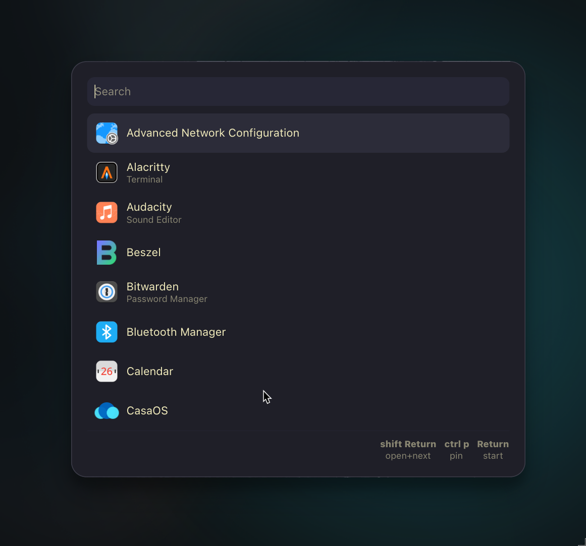

# Walker Docs

> This documentation is not officially maintained by the Walker team, but is provided by the community.
> It is not guaranteed to be up-to-date or accurate.

Static documentation site for Walker, built with Next.js (App Router), MD, and Tailwind CSS. It includes a Flexisearch client-side search.

## Quick start

- Requirements: Node 18+ (tested on Node 20/22), npm
- Install and run dev server:

```bash
npm install
npm run dev
# open http://localhost:3000
```

## Content structure

- App Router with MDX pages under `app/`:
    - Home: `app/page.mdx`
    - Top-level pages: `app/<slug>/page.mdx` (e.g., `docs/cli/page.mdx`)
    - Built-ins: `app/builtins/<slug>/page.mdx` (one per module)
- Shared components: `components/` (Sidebar, SearchBox)
- Tailwind + typography plugin configured

## Scripts

- `npm run dev` — dev server
- `npm run build` — production build
- `npm run lint` — Next.js lint rules
